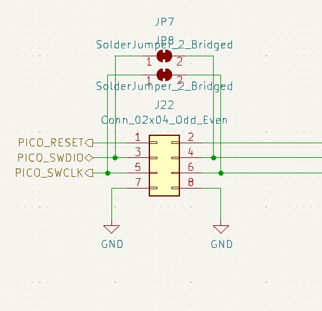

# omros2-firmware

## Overview

This is a OpenMower mainboard firmware replacement to work with [OpenMowerROS2](https://jkaflik.github.io/OpenMowerROS2/) alternative ROS software.
More details about this firmware can be found in [documentation](https://jkaflik.github.io/OpenMowerROS2/omros2-firmware.html).

## Build

### Prepare environment
By default, Raspberry Pi SWD on a remote Raspberry Pi is configured as the upload & debug protocol.

To use it, you need to install on a target Raspberry Pi an openocd with support for the Raspberry Pi SWD interface.
Please refer to the [RaspberryPi documentation](https://www.raspberrypi.com/documentation/microcontrollers/debug-probe.html#linux-and-raspberry-pi) for more information.

On the hardware side, you need to connect the Raspberry Pi SWD interface to the target SWD interface.
Luckily, on the OpenMower mainboard there is are circuits to do so. All you have to do is to use 4 jumpers on J22.



When executing build/debug target, along with firmware, [the bash script](utils/remote-openocd.sh) will be deployed to target Raspberry Pi and executed.

### Build (& run)

```bash
platformio run -t upload
```
(**note**: you can use `pio run` as well, so it doesn't upload to target)

## Debugging

Since I haven't managed PlatformIO to run my command beforehand, you need to run it manually:

```bash
scp ./utils/remote-openocd.sh openmower.local:/tmp/remote-openocd.sh && ssh openmower.local /tmp/remote-openocd.sh debug
```

Then you can run debugging session in your IDE. (VSCode or CLion)
