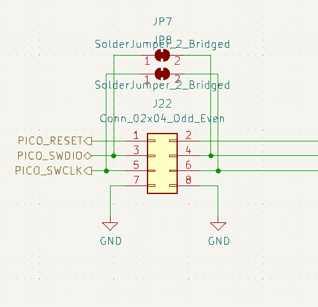

# omros2-firmware

## Overview

This is a [OpenMower](https://github.com/ClemensElflein/OpenMower) mainboard firmware replacement to work with [OpenMowerROS2](https://jkaflik.github.io/OpenMowerROS2/) alternative ROS software.
More details about this firmware can be found in [documentation](https://jkaflik.github.io/OpenMowerROS2/omros2-firmware.html).

## Features

- [x] ROS2 node using Micro-ROS
  - [x] Auto-reconnect
  - [x] Power-related publishers
  - [x] IMU publisher
- [x] Charging
- [x] LED status
- [x] IMU
- [x] Emergency mode
  - [x] Emergency publishers
  - [x] Latched emergency command topic
- [ ] Cover panel support

## Usage

### LED Status Indicators

The firmware uses onboard NeoPixel LED(s) to display the current system status. Multiple status conditions can be active simultaneously and will be displayed in sequence.

**LED Status Colors:**
- **Green**: ROS connected
- **Yellow**: Battery charging
- **Magenta**: Battery discharging
- **Red**: Battery low
- **Blue**: IMU sensor failure
- **Blinking red**: Emergency latch active

When multiple statuses are active, each status will be shown for approximately 800ms with a 200ms black separator between them. The sequence will continue to cycle through all active statuses.
Emergency has priority over the normal status sequence and is shown as a blinking red LED.

### Emergency ROS API

Emergency state is published at 10 Hz:

| Topic | Type | Description |
| --- | --- | --- |
| `emergency/status` | `omros2_firmware_msgs/msg/EmergencyStatus` | Combined emergency status. |

`EmergencyStatus` fields:

| Field | Description |
| --- | --- |
| `active` | Emergency latch is active. |
| `stop_active` | Stop input is active after debounce. |
| `lift_active` | Lift emergency is active. |
| `tilt_active` | Tilt emergency is active. |
| `software_requested` | Emergency was requested by ROS. |
| `release_blocked` | Release is blocked by an active physical input. |
| `lifted_wheels` | Number of active lift inputs. |

Commands are accepted on `emergency/command` as `std_msgs/msg/Bool`:

| Value | Meaning |
| --- | --- |
| `true` | Request/latch emergency. |
| `false` | Request emergency release. |

The same command value must be received three times within one second before it is accepted.
Release requests are ignored while any physical stop/lift/tilt input is active.
The emergency latch starts inactive after boot when physical inputs are clear.
Physical stop/lift/tilt inputs and `emergency/command=true` latch emergency explicitly.

## Build

### Prepare environment

> [!IMPORTANT]
> This firmware is meant to be run on a [OpenMower](https://github.com/ClemensElflein/OpenMower) hardware or compatible.

Firmware is build against a RP2040 chip only using PlatformIO.
Default target is a remotely run OpenOCD with a Pico board as a SWD target.
Everything should work out of the box. Make sure your `--upload-port` is your Raspberry Pi host. (one used for the OpenMower)

> [!NOTE]
> Only Raspberry Pi5 is supported. OpenOCD configuration is crafted for it. If you want to use another board, see older commits in this repository.

On the hardware side, you need to connect the Raspberry Pi SWD interface to the target SWD interface. Luckily, on the OpenMower mainboard there is are circuits to do so. All you have to do is to use 4 jumpers on J22.



When executing build/debug target, along with firmware, [the bash script](utils/remote-openocd.sh) will be deployed to target Raspberry Pi and executed.

### Build (& run)

```bash
platformio run -t upload
```
(**note**: you can use `pio run` as well, so it doesn't upload to target)

## Debugging

Use your IDE integration to debug the code. You can use `pio debug` command as well.
This will run the same bash script as in the upload command, but it will not upload the firmware. You can use `pio debug -t upload` to upload the firmware and start debugging.

## Micro-ROS agent for testing

You can use the Micro-ROS agent container to test the firmware. To run it a remote RaspberryPi device run the following command: 

```bash
make agent_remote
```

If you have an access to the Pico's UART0 directly on your host machine run:

```bash
make agent MICRO_ROS_DEVICE=/dev/ttyAMA0
```

## Hardware-in-the-loop tests

The emergency feature has an interactive ROS 2 hardware test for real OpenMower hardware.
Run it with flashed firmware and a running micro-ROS agent:

```bash
source /opt/ros/jazzy/setup.bash
colcon build --base-paths extra_packages --build-base build/hil --install-base install/hil
source install/hil/setup.bash
python3 test/hil/emergency_interactive.py
```

The test guides the operator through pressing STOP, activating one lift sensor, and activating two lift sensors. It verifies the published emergency status and the three-message command confirmation rule.
The test is rerunnable on the same firmware boot; if the emergency latch is inactive at the start, the script reports that expected state and latches before checks that require an active latch.
